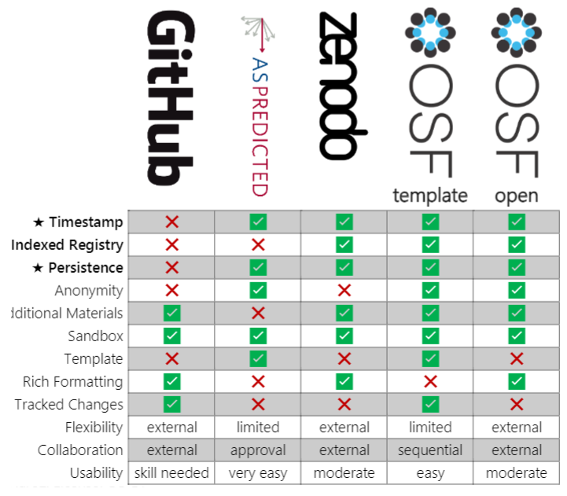

# Chapter 2: Preregistration and Open Protocols

**Authors: Nadza Dzinalija, Eva van Heese, Lucas Baudouin;**
**Reviewers: Juliette Castelot**

## In this Chapter
This chapter focuses on protocols or analysis plans for a study, how you can (and should) share them beforehand, and how you can find those described by others. The first part of the chapters explains preregistration, which is applicable to all types of neuroscience projects. In the second part, we highlight open protocols in the context of neuroscience-related lab work. 

## The Preregistration Revolution
Progress in science relies on two processes: prediction and postdiction. Prediction involves the generation of hypotheses from existing data (exploratory), and postdiction includes testing hypotheses with new data (confirmatory). The same data cannot be used to do both, but this can happen unintentionally as the distinction between the two is generally appreciated on a conceptual level, but not respected in practice. The blurring between prediction and postdiction reduces the credibility of research as natural biases in human reasoning (i.e. the hindsight bias) are difficult to avoid (Nosek et al., 2018). 
To keep a clear separation between prediction and postdiction, research ideas and hypotheses should be defined before observing outcomes. This is the main aim of **preregistration**. 

Preregistration is the practice of registering research questions and their hypotheses, as well as the analysis plan to investigate them, before or during a study. This registration helps to distinguish between statements based on exploratory and confirmatory investigations. Preregistration is offered for a variety of practical set-ups, for example, when data already exists, or for new studies. 
Widespread adoption of preregistration will increase the distinction between hypothesis-generating and hypothesis-testing research and improve the credibility of science. 

## Pros and Cons
Writing a preregistration comes with pros and cons. In the table below, we set out the most important points to consider.

| Pro           | Con           |
| ------------- | ------------- |
| Separates hypothesis-generating and hypothesis-testing research → improves the **credibility** of your research | Takes **time** and additional **preparation** |
| Improves **transparency** of your research (avoids duplicate studies, reinventing the wheel, making the same mistakes as others) | Creates **additional work if plans change** later (changes need to be reported) |
| Improves **efficiency** and **planning** of your research |  |
| Improves the **quality** of your research |  |
| Aids in **clearly reporting** your research |  |
| Can help when **publishing null results** |  |

## Practical decisions
### Who can publish a preregistration?
Anyone! Whether you are an undergraduate student, PhD candidate, postdoctoral or more senior researcher, you can write and publish a preregistration. Regardless of whether the final product will be published in a scientific journal, your analysis plan can be described and published beforehand.

### Types of preregistrations
There are a few main types of preregistrations:
- **Basic preregistration**
  This is the most used registration, and it is not peer-reviewed before submission. Here you create a detailed description of your research plans before you begin your research, and save them in an online repository that has a time-stamp and is no longer editable after submission. You can also put an embargo date on your submission so that it only becomes widely available after a desired period of time has passed. 
- **Secondary data preregistrations**
  This is a variant of the first registration, where the registration is made after the data has already been collected, but before analyses have been done. This is also suitable if you are re-using an existing dataset for new analyses.
- **Registered report**
  This is a type of peer-reviewed registration that is done in collaboration with a journal (note that only some journals offer this). Here, you follow similar steps as above, but your preregistration is subjected to a peer-review process, whereby the journal pledges to publish your findings regardless of the outcome if they accept your preregistration. 

### Platforms
There are several platforms you may consider using, each with their own (dis)advantages (see Figure 1 for an overview). A personal account is required to view the available templates and select one for your preregistration. It is generally possible to invite future co-authors to collaborate on a preregistration in this environment.
- Open Science Framework
- AsPredicted
- Zenodo
- GitHub

Figure 1 - Comparisons of preregistration platforms (Haroz, 2022).  

## Essential Elements
It is essential to include all confirmatory analyses in your preregistration. This will look a little different for all studies, which is why a good rule of thumb is to imagine you were writing the method section of your paper, and include anything that you would typically include there. This can include:
- **Study population** (if already collected then include demographics like age, gender): mention inclusion/exclusion criteria.
- **Materials**: measures taken, how concepts were operationalized or quantified, what cutoffs or criteria were used in the process.
   - It is important to list all measures taken, not only the ones you plan to use. If you pick one outcome measure over another similar measure, explain how/why you operationalized it that way.
- **Methods**: procedures followed. If you have a Standard Operating Procedure (SOP) for your study this can serve as an excellent basis for this section. 
- **Analyses**: specific statistical tests you will run. Clarify the (in)dependent variables you input and how these are obtained. Mention also the inference criteria you will use from those tests. If multiple testing problems may occur, mention how you correct for those. The report also any sensitivity analyses you perform. Also specify the software and tools that you will use to process the acquired data.
- **Hypotheses**: from each analytic test you plan to do there should follow a hypothesis. If you expect group differences, mention which direction they are in (which group has higher/lower effects). There may be sub-hypothesis under larger hypotheses when there are multiple groups to capture the relationships between all groups.
   - It is a good idea to substantiate your hypotheses with existing literature, if available. This can also be done at the start of the preregistration in the form of a short introduction.
- **Power analysis**: if a power analysis was done, report it, otherwise report what power you infer post-hoc from the sample you already have.

It is not essential to include exploratory analyses, when you do not (yet) have a clear idea of what you will test or what results you may expect. You may nonetheless consider including any additional analyses you already know you want to perform. The rules are not so strict as for confirmatory analyses, so if it is not yet clear how you will define a particular variable, or if you need to see whether certain patterns emerge from the data before you do a particular test, that can be described here. It is encouraged but not always necessary to describe in detail the statistical analyses and hypotheses you have for exploratory analyses. There isn’t always a clear distinction between ‘exploratory’ and ‘confirmatory’ research, and for your own study you are responsible for where you draw the line. An exploratory analysis may be appropriate if it is difficult to make a prediction based on prior work, or there is simply not enough information yet. But, anything that is included as an exploratory analysis needs to also be discussed that way in the results, and needs to be validated before any strong conclusions can be drawn from it.

If a preregistration has been written, many people consider there is a duty to write up the results and make the report available on an (open) repository even if there were no interesting/meaningful results and/or if you do not plan to submit it for publication anywhere. There are a few other points to pay attention to when reporting the results of preregistered research:
- Include the link to the original preregistration in your manuscript
- Report any deviations made from the preregistrations honestly and completely
- Report results of all preregistered analyses

## Open Protocols
We have all faced the dilemma of who to seek advice from when we wish to test a particular antibody or protocol that we have encountered in a publication. Regrettably, we may not have anyone in our circle of colleagues who can provide the guidance we need, and we may end up conducting a series of fruitless trials before arriving at a definitive outcome. However, as fate would have it, we may later stumble upon a protocol that could have spared valuable time. This situation is not uncommon, and there are remedies that can be summarised in two instances: the sharing of existing validated protocols and the sharing of negative results (see more in Chapter 7), which serve as the foundation of many research projects but are not typically featured in scientific publications. This section focuses exclusively on protocol sharing.

- **eLab Journal**: eLab is a collaborative, digital lab management environment and offers the possibility of documenting a research workflow and managing other important laboratory information. It may seem obvious, but more and more institutions are making the transition from the paper lab notebook to the digital lab notebook, enabling massive information sharing within a group or a department. eLab journals are the first source of information for anyone joining a new lab. But this type of sharing remains limited and cannot be extended to an entire community.
- **Community**: So when expertise is not available in our lab, the first source of mutual help is online communities, such as [Researchgate](https://www.researchgate.net/). Created in 2008, this site brings together a large number of protocols in the form of discussions, where mutual help is the watchword. All disciplines are represented, which also allows for cross-disciplinary exchanges. 
- **Education materials**: Another useful resource for gaining a deeper understanding of theoretical concepts and their practical application is online course materials. Typically, these materials are designed to provide guidance on potential pitfalls rather than presenting detailed procedures. A comprehensive overview of such examples can be found on the [EMBL-EBI Training](https://www.ebi.ac.uk/training/on-demand?facets=type:Course%20materials).
- **Peer-reviewed journals**: There are protocols published in peer-reviewed articles. Publications are a valuable resource and serve as evidence that procedures can be applied under the experimental conditions described in the articles from which they originate. However, these publications provide an overview of the experiments and aim to provide a general understanding of the major steps involved, as well as references to the products used. They are not intended to provide detailed protocols, which limits the ability of novices to replicate experiments. To address this, some journals specialise in transparency and method sharing, such as [Cold Spring Harbor Protocols](https://cshprotocols.cshlp.org/), [Nature Protocols](https://www.nature.com/nprot/), and [Jove](https://app.jove.com/methods-collections). Jove is distinctive in offering a wide range of multi-disciplinary methodological videos, from molecular to macroscopic analysis, including MRI. These journals have an open access policy, but it is not universal to all publications, meaning that full access to their catalogue of articles/videos is not possible.
- **Open Access Journals**: In order to address this difficulty, it is recommended to identify scientific journals that focus on disseminating experimental protocols entirely freely accessible. A noteworthy illustration of such a publication is the [STAR](https://star-protocols.cell.com/search)(Structured Transparent Accessible Reproducible) Protocols journal, published by Cell Press. This journal offers a comprehensive selection of methods, presented in a step-by-step manner, with the significant advantage of having been subjected to peer review.
On the other hand, it is possible to find other alternatives through open repositories for protocols. These archives allow open sharing, with no peer-review procedure and no costs for publication or registration. Another advantage, and not the least, is that the articles made available are assigned a DOI for citation purposes and published under a CC-BY licence. This means that anyone is free to reuse these methods. Two major players are currently involved in these procedures: [protocol.io](https://protocol.io/lander) and [Protocol Exchange](https://protocolexchange.researchsquare.com/). Importantly, several publishers are working in collaboration with protocol.io to make more detailed protocols from their articles available, as is the case with the [Lab Protocols](https://collections.plos.org/collection/lab-protocols/) initiative launched by Plos One and Nature Protocols.

## References
Nosek, B. A., Ebersole, C. R., DeHaven, A. C., & Mellor, D. T. (2018). The preregistration revolution. Proceedings of the National Academy of Sciences, 115(11), 2600-2606.

Haroz, S. (2022, February 24). Comparison of Preregistration Platforms. [https://doi.org/10.31222/osf.io/zry2u](https://doi.org/10.31222/osf.io/zry2u)
