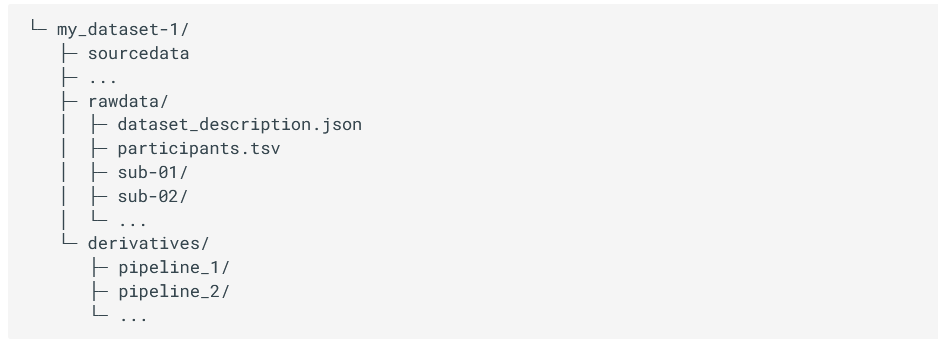
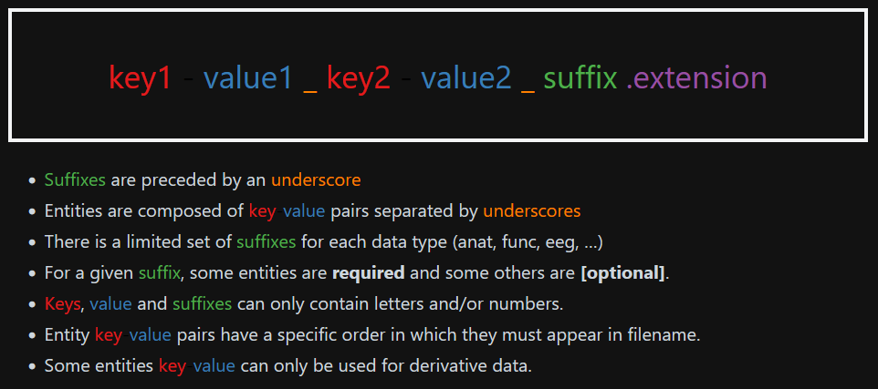
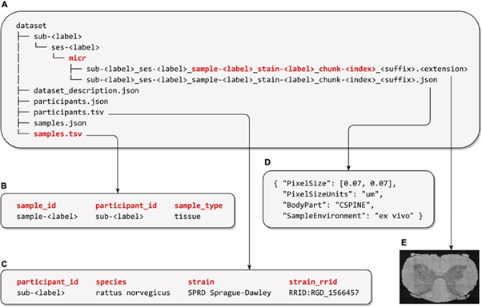
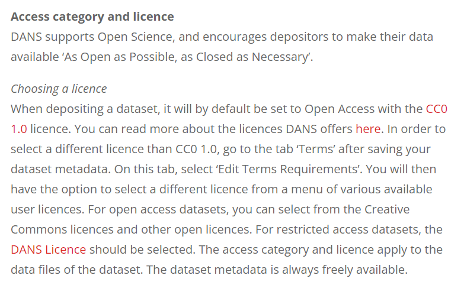

# Chapter 3: Open Data in Neuroscience
**Authors: Mar Barrantes-Cepas, Eva van Heese, Lucas Baudouin, Bernardo de Azevedo Pinto Castro Maciel;**
**Reviewers: Janneke Lemmerzaal, Mar Barrantes-Cepas, Eva van Heese, Lucas Baudouin;**
**Senior Reviewer: Chris Vriend**

## Data Definition 

First, what is neuroscience data? Neuroscience data encompasses everything you use or produce during the research cycle, from raw to derived datasets, software, code, workflow, models, figures, tables, articles, etc. Everything contains a piece of information, such as brain imaging (for instance, MRI, PET, EEG, MEG), cognitive and behavioural data, and cellular, histological, and molecular evaluations of brain samples from humans or animals. All this data follows a [lifecycle](https://the-turing-way.netlify.app/reproducible-research/rdm/rdm-data) that involves data creation, use, publication and sharing, archiving, and re-use or destruction. 

The scope of the present chapter includes data organisation and sharing, all information related to software, code, and workflows is explained in [Chapter 4](https://marbarrantescepas.github.io/OS-neuroscience/tabs/4.%20Open%20Software%20&%20Tools.html).  

### Personal data

Personal data in neuroscience refers to an individual's personal information that can identify the person, i.e. birth date, address, security number, raw (structural) MRI scan, genetic information, etc. The use of personal data has significant implications for privacy and ethical considerations. Personal data is not always as evident or attainable to identify as we think. For example, imaging DICOM headers might contain the person’s name or date of birth, or from structural MRI scans, we can easily identify the person’s face if it’s not defaced (see software and tools in [Chapter 4](https://marbarrantescepas.github.io/OS-neuroscience/tabs/4.%20Open%20Software%20&%20Tools.html)). As researchers, we must ensure responsible handling of personal data by anonymising our data properly in case of storing and sharing it, following the ethical protocols.

### Documentation and Metadata

#### **For datasets**
 
Data without context is of no use. However, metadata and documentation can provide provenance and context to datasets. Therefore, you should ensure that any dataset, but especially open datasets, includes consistent metadata and documentation that provides insightful information about how the data was collected (at least!) and other characteristics . Metadata is often intended for machine reading, but some forms are human-readable. Basic metadata can be described on the level of the dataset (title, study summary, keywords, contact information, licence) and data elements (variable name, description, unit, modification date). Advanced metadata may describe the frequency of updates and what has changed or been updated (e.g., a changelog), temporal coverage (cross-sectional, longitudinal, follow-up duration), and spatial coverage (i.e. geographic area). 

#### **For data processing and analysis**
 
For data processing and analysis, keeping organised and descriptive documentation about the step-by-step process is key. Whereas each lab generally does this in its own manner, the movement of open data and open scripting has set some standards on how to improve documentation for yourself and others. A couple of essential elements to include in your documentation are:
- a summary of the general steps (i.e from raw data to outcome)
	- for example in a flowchart
	- for example a participant flowchart (mention inclusion and exclusion criteria, reasons for data exclusion or missing data)
- the software, automated pipelines, scripts or other tools applied
	- specify version, platform, and other environmental details
	- specify decisions made (manual settings)
	- for code: provide examples from your actual code
	- correctly cite these tools and their documentation
- troubleshooting: issues you encountered and their solutions
	- describe common mistakes
	- describe steps that require a cautious approach
	- cite solutions or workarounds provided online
- quality assessment
	- which checks should and could be performed?
	- how does good/bad data look? provide examples (images!)

Documentation will look different for each analysis and can be described in many formats: a (shared) document, spreadsheet, or environment that allows for files and code to be incorporated (for example [Github](https://github.com/) or [Zenodo](https://zenodo.org/)). Important is that the documentation can be understood by anyone (with the expected background knowledge) and used as a guide to perform the analysis described. 

### Creative Commons and data licensing

Licenses provide a standardized way for others to use your creative work under copyright legislation. The different Creative Commons (CC) licenses describe what permissions the public has to do with your work. The license types are formed by combinations of sharing principles:

- **BY:** credit must be given to the creator
- **NC:** only non-commercial uses of the work are permitted
- **SA:** Adaptations must be shared under the same terms
- **ND:** No derivatives or adaptations of the work are permitted

Together, they result in six licence types (CC BY-SA, CC BY-NC, CC BY-NC-SA, CC BY-ND, CC BY-NC-ND). A seventh licence type (CC Zero or CC0) allows the creator to give up their copyright and all public users to adapt, build upon, and distribute the original work without any conditions. You can consult the online tool [Licence Chooser from CC](https://chooser-beta.creativecommons.org/) if you struggle to choose a license for your work. Interested to read more about CC licenses? Check out [this page](https://creativecommons.org/share-your-work/cclicenses/). 

## Data Management Plan

How to manage your data is usually described in a Data Management Plan (DMP). It provides information on six main topics: **(i)** roles and responsibilities, **(ii)** type and size of the data collected and documentation or metadata generated, **(iii)** type of data stored used and backup procedures that are in place, **(iv)** preservation of the research outputs after the project, **(v)** re-use of your research outputs by others and **(vi)** costs (see more details at [Turing Way](https://the-turing-way.netlify.app/reproducible-research/rdm/rdm-dmp#rr-rdm-dmp)). 

Before creating your own DMP, we recommend consulting with your institution to see if they have a specific template for the DMP. If you are from the Amsterdam UMC, please check [their page](https://www.amsterdamumc.org/en/research/support/services-facilities/data-management/data-management-plan-dmp.htm). Moreover, we recommend creating a checklist/roadmap before starting your research with the steps that need to be performed in order to make your project as according to open science principles, and the requirement or things you need to check for each step. For example, can everyone from your team understand how the data is organised or where to find it with the minimum knowledge? More information can be found at [Turing Way](https://the-turing-way.netlify.app/reproducible-research/rdm/rdm-checklist) or in the case of [Amsterdam UMC](https://www.amsterdamumc.org/en/research/research-roadmap.htm).   

## FAIR principles  

It's recommended to follow the FAIR principles in data for improving **F**indability, **A**ccessibility, **I**nteroperability, and **R**eusability. If you plan it from the beginning, it is easier to make data [FAIR](https://the-turing-way.netlify.app/reproducible-research/rdm/rdm-fair). Making data FAIR is not the same as making it open. **Keep in mind that data should be as open as possible and as closed as necessary.** Accessible means that there is a procedure in place to access the data that could benefit sharing data or methods within your own group, department or institute and re-use existing pipelines without having to put much effort into finding data. 

## Data Storage and Organisation 

Storing your data correctly is important to prevent data loss, which happens more often than we would like. To avoid data loss, it’s recommended to pick a suitable storage system and back up your data frequently (if not already done automatically by the storage facility). Your institution will usually provide information on how to store your data. Consult what the different storage systems of your institution are and how you can back up data correctly. You can either consider using cloud storage if your data protection allows it or encrypting your data before storage (ensure keep the decryption password safely!).  

At the same time, organising data in a meaningful and FAIR way may be challenging, especially at the beginning of new projects where we are not fully sure of all the intermediate files. You should use a clear folder structure to ensure you can find your files; ideally not one you make up yourself but based on consensus with your colleagues, institute or research community.

In the following paragraphs, we divided our recommendations depending on which kind of **neuroscience data** you are working with: brain imaging (MRI, PET, EEG, MEG), cognitive, behavioural, cellular, histological, or molecular data. 

### Brain Imaging Data Standards

Brain Imaging Data Standards (BIDS) is a community-driven consensus on how to organise and share data obtained in neuroimaging experiments (everybody can become part of the [community](https://bids.neuroimaging.io/get_involved.html)). Lack of consensus led to time wasted on rearranging data or rewriting scripts to fit the data structure. More information about the guidelines and [specifications](https://bids-specification.readthedocs.io/en/stable/index.html) can be found at [BIDS webpage] (https://bids.neuroimaging.io/).  

#### **BIDS project folder structure**

Briefly, each project has a main folder containing a *sourcedata*, *rawdata* and *derivatives* folder, where different types of data will be stored. *Sourcedata* is meant to be for data before any kind of conversion, reconstruction and/or harmonisation (i.e. DICOM), *rawdata* is expected to contain the data converted to NIFTI and JSON format, and finally, *derivatives* should contain all the files derived from your analysis. 

Figure 3.1 -  (a) Structure of the project folder organised according to BIDS format. (b) Different modalities specifications. Image from [1].

Inside *sourcedata* and *rawdata*, we should have a folder for each subject of the study named **sub-SUBID**, where SUBID is the code or identifier of that particular participant, and a **tsv file** containing the information of our dataset. Inside the subject folder, it is expected to have a subfolder per session in case of longitudinal data. We would recommend adding a session folder even in cross-sectional studies. You never know if it will be longitudinal later on! 
Inside the session (if it exists) or the subject folder, we should have a subfolder for each modality i.e. anat, func, dwi, etc., containing anatomical, functional, diffusion or other type of data respectively. See more information about the [specifications of different modalities](https://bids-specification.readthedocs.io/en/stable/modality-agnostic-files.html). 

#### **BIDS file naming structure**

Finally, the files MUST be named in a certain way to be machine-readable. There are three main types of data (or extensions): **.json** files containing metadata, **.tsv** files containing tables of metadata and raw data images (with **.jpg** or **.nii.gz**). All files follow a similar structure that includes using **keys**, the corresponding **value** to that key, a **suffix** and, finally, the **extension**. Keys are always paired with values, some of them are mandatory to have, for instance, the subject name (i.e. key would be sub- and the value is the corresponding SUBJID). Others are recommended or optional. Suffixes are mandatory and indicate the kind of data. For a given sequence (recognized by its suffix), some so-called “entities” are required (Fig. 3.2). An entity is a key-value pair that provides metadata about a file, such as subject ID, session, modality, or acquisition parameters. More information about the specifications for each kind of data can be found [here](https://bids-specification.readthedocs.io/en/stable/modality-agnostic-files.html). 

Figure 3.2 - Structure of the file name following the BIDS format. Image from [2]

{: .warning }
> If at this point you are lost and don’t know where to start, we recommend you check the BIDS starter kit and consult experienced people on the field or the BIDS community. 

#### **BIDS converter and validation tools**

There are some tools that organise DICOM data directly to BIDS format. From our personal experience, we recommend **BIDScoin** and **dcm2bids**. However, there are more tools available that can be used for converting your source data into BIDS format. Find more about these tools at https://bids.neuroimaging.io/benefits.html#software-currently-supporting-bids.

Furthermore, there is a validator available to check if your data is correctly organised, called [BIDS validator](https://github.com/bids-standard/bids-validator). Although the tool can be useful, the validator is not always up to date with the latest version of the BIDS structure. If you are struggling with the validator, please check it with someone more experienced or contact the BIDS community directly. 
 
#### **BIDS derivatives** 
Coming soon
{: .label .label-yellow }

#### **BIDS citations**
Be nice and don’t forget to cite in your study the BIDS citations if you are using them! 

### **BIDS in Microscopic Data**

Whereas BIDS has been originally designed for macroscale data, the BIDS specification has recently been extended to the microscopy field (Bourget et al. 2022), which included a wild variety of applications. 

As explained at the beginning of this section, the ideas behind this initiative remain the same: to properly identify which type of experiments have been conducted on one sample and have a track record of the parameters used during the acquisition of the specimen. All to avoid confusion and facilitate the comprehension of methods.  

Our department has yet to fully embrace this classification method, which is why we only provide a complete overview of the differences between this microscopy section and the original version, as well as the types of data to which it may be applicable.

#### **For which type of acquisition?**
BIDS format can be applied to 17 different types of data, covering all conventional microscopy methods. This includes fluorescent imaging (epifluorescence, confocal and super-resolution), electron microscopy (SEM and TEM) and multi-photon imaging (2P and 3P). 

#### **For which kind of species?**
As the original format was designed for human studies, an additional description has been added in the participants.tsv file to include animal or cell metadata. In this description, three columns have been added to specify the species itself but also the name of the strain of the species and its research resource identifier (RRID) that could be very helpful in case of transgenic animal or cell line. 

#### **What kind of information may be found?**
As explained in the previous part, all details regarding the parameters used to acquire an image can be found into the accompanying .json files. It must contain the same type of critical information that should be included into a material and method section of a publication to ensure the reproducibility of the experiment. This include parameters such as:
	- Image acquisition (pixels size, lens numerical aperture, magnification)
	- Sample characteristics and how it has been proceeded (body localization, fixative/embedding used, coloration/staining)
	- Chunk transformations (in case the field acquire is composed by multiples tiles)
	- Hardware information (Manufacturer and software characteristics) 

#### **Which format can be used for metadata?**
Different manufacturers typically utilise various file formats to store metadata, such as .czi for ZEISS, .lif for Leica, and .vsi for Olympus. However, these specific formats often necessitate the use of specialised (non-open access) software, which can hinder the process of data sharing. In this context, it is recommended to prioritise the OME-TIFF file format (.ome.tif) as it allows for multiple image planes and supports multi-resolution pyramidal tiled images. Alternatively, it is recommended to prioritise .png or .tif formats to avoid any loss of resolution. It is also important to note that, in cases where only a single resolution file format from a pyramidal file format is needed, only the higher resolution file should be present in the raw data.

In summary, this type of data storage, which is constantly evolving and improving, provides a consistent way to associate a file with the necessary metadata needed to perform further image analysis (Fig 3.3). A more comprehensive and exhaustive overview concerning how to properly apply the BIDS format on your dataset can be found [here] (https://bids-specification.readthedocs.io/en/stable/modality-specific-files/microscopy.html). 

Fig 3.3: Illustration of rat spinal cord SEM overview following a BIDS format, modified from Zaimi et al., 2018 and extract from Bourget et al. 2022.

### **Big Genetic Datasets**
There are many ways to capture interindividual genetic variation. In order to make it simple, we are going to look at the most commonly analysed variants: Single Nucleotide Polymorphisms (SNPs). SNPs are places in the genome where one letter differs between people, for example, in chromosome 19, position 44908822 some people have a C (Cytosine) base, others have a T (Thymine). This is the APOE SNP, an important genetic factor for Alzheimer’s disease. This SNP would be represented either by a SNP ID - in this case, 19:45412079:C_T (usually written in the form chromosome:base pair:allele1_allele2) - or by its rsID - rs7412 (which you have to look up online).

“Genomic data” usually refers to data either from whole genome/exome sequencing or from SNP arrays. Because we mostly know which positions of the DNA are SNPs, we mostly use SNP arrays to genotype people as this technology is more accessible than whole genome sequencing, especially for genotyping (large) datasets of clinical populations, which is why we will focus on this method in this chapter. However, it is important to keep in mind that this approach has certain limitations: it may fail to detect genetic variations that are not part of the SNP array being used, which is particularly important to keep in mind if we are interested in rare genetic variation. 
Here’s a video if you want to know more about [SNP arrays](https://www.youtube.com/watch?v=PeFOjLEJkrA) or [next generation sequencing(whole genome/whole exome) genotyping]( https://www.youtube.com/watch?v=MvuYATh7Y74&t=1s).

SNP arrays can be seen as a bunch of lightbulbs on a plate: if the SNP is present, the well lights up, if it isn’t present, it doesn’t. This information is usually stored in VCF (variant call format) files. The first step of every genetic analysis pipeline is quality control of these reads and hard-calling them, that is, make the good quality SNPs a 0 (absent) or a 1 (present). For more information on quality control, see [this video]( https://www.youtube.com/watch?v=xkA0qRxfDLs). 

#### **Genomic builds**
One of the most crucial aspects to consider when handling a VCF file is the genomic build on which it is founded. The genomic build is a different reindexing of the genome. This has consequences for  genomic positions and SNP IDs (and rsIDs). There are two main builds, equally used, GRCh37 and GRCh38. Most of the newer big datasets are using GRCh38 but a lot of the data is still in build GRCh37. The same APOE SNP is 19:44908822:C_T in GRCh38 and 19:45412079:C_T in GRCh37, which can lead to major interpretation errors! Here’s [a video]( https://www.youtube.com/watch?v=DeZTPCOKZrg) with more information on genomic builds.

Once you have hard-called the SNP data as described above, they can be stored in VCF format or transferred to a more optimised binary format like the plink format. Plink is a popular state-of-the-art tool in statistical genetics that allows you to do all sorts of quality control, genome-wide association studies, etc. Plink format (.bim, .bed, .fam) is widely used and supported across many different genetic tools. Plink format contains 3 files. The build of the genome is not specified anywhere in these formats. You always have to mind the meta-data. 

	- .bim is the file with all the variant information: chromosome (19), position (45412079), name (19:45412079:C_T), reference allele (C) and alternative allele (T). You can use the information of this file to check the build. Look for the chromosome and position of some SNPs in dbSNP to see whether they match build GRhC37 or 38.
	- .fam file which contains subject information and relatives information (whether the subject has any relatives in the sample).
	- .bed is a non-human readable binary file with a gigantic matrix with the information of your subjects (rows are SNPs, columns are subjects).

This text serves merely as an overview. The critical aspect to consider is that these files cannot be altered manually as doing so may result in misalignment, compromising all analyses. Furthermore, these files cannot be separated as they contain complementary information, and software programs require all of them to function properly. For additional information, please refer to the following [page](https://www.cog-genomics.org/plink/1.9/formats#fam):. 

There are quite some steps missing to perform your analyses but this should give you an idea of the basics! For more information on all of the steps from collecting DNA to discovering processes relevant for disease you can look up the following resources:
[PGC Video Textbook](https://pgcanalytics.github.io/pgcvideotextbook/)
[A molecular genetics perspective on the heritability of human behavior and group differences](http://gusevlab.org/projects/hsq/)
[GWAS Tutorial Guide](https://cloufield.github.io/GWASTutorial/)
Or contact me! (b.maciel@vu.nl).

### Clinical data management
For clinical, demographic, and behavioural data, accurate and meticulous data management is essential to create a high-quality database for statistical analysis. Procedures to ensure high-quality standards include database designing, data entry, data annotation, data validation, discrepancy management, and database locking. A review article highlights the processes and recommended tools for clinical data management (Krishnankutty et al., 2012). Common software for Electronic Data Capture (EDC) include: REDcap, Castor, Greenlight Guru Clinical, Medidata Rave, Clinion.

Spreadsheets and documents are widely used for various purposes including collecting, storing, manipulating, analysing, and documenting research data. However, it's important to exercise caution as improper use of them can lead to significant errors in workflows. Our recommendation is to follow the [Turing Way](https://the-turing-way.netlify.app/reproducible-research/rdm/rdm-storage). 

### **Work in progress**
For some data types, there is no standard yet. Efforts are ongoing in various fields to develop standardised approaches for data storage and sharing. While there's still progress to be made, we recommend reaching out to colleagues engaged in similar work or data. Collaborating and sharing experiences can provide valuable insights into effective data storage practices.

## Sharing your own data
Besides sharing your results in a manuscript, it is becoming good practice to also share your methods (scripts, pipelines) and even your data (raw or processed) with the world. This way, others can apply your methods to their own data, or even replicate or further investigate your results in the original dataset. We’ve already discussed the sharing of analysis documentation earlier in this chapter. Several platforms exist to facilitate the sharing of raw and processed data. 

Importantly, always ensure you know what you are permitted to share and what is restricted. Before sharing anything, we recommend consulting with your institution's legal team and privacy officer. If data sharing is not allowed (e.g., due to a lack of participant consent), shift your focus to sharing other valuable components like metadata or documentation as part of promoting transparency. 

### DANS: Data Archiving and Networked Services (Dans-KNAW)
[DANS](https://dans.knaw.nl/nl/) is a service offered by the Dutch national centre of expertise and repository for research data, which supports researchers in making their data available for reuse. DANS is not specific to neuroscience but ensures sustainable access to research data in fields ranging from social sciences to life, and physical sciences. DANS currently offers more than 200.000 datasets in their repository. It is possible to either [deposit data](https://dans.knaw.nl/en/depositing-data-manual/) or search for data in their field-specific data stations. When depositing data, you sign a deposit agreement, stating the terms of the licences for reuse. There are two access categories: open access (accessible to everyone, no login required) and restricted access (with your prior consent users may view and download data). After publication by DANS, the dataset receives a persistent identifier and will be permanently archived and accessible to others. When downloading a dataset from the repository, users have to accept a data use agreement (Fig. 3.4). Note that for pseudonymous data, most institute ethical boards require that the data are deleted after 15 years. This is possible, but not facilitated by DANS (the user agreement states that you may request changes, temporary unavailability, or permanent removal of your data from the platform). 

Figure 3.4 - DANS repository - choosing a license.

### Data curation
Data curation, in other words, means “cleaning up your data for them to be used for any purpose”. After data collection, the process of data curation can be broken down into several steps:
- **Appraisal:** Select the appropriate data
Enter, digitise, transcribe, check, validate, clean, and (pseudo)anonymise the data
- **Disposal:** Discard data based on the appraisal step
Archive, transfer ownership of, or destroy the data
- **Description:** Write documentation and metadata, choose a licence
- **Preservation and access:** Keep the dataset and its descriptions in a data repository based on the sharing restrictions of the data (restricted/open access)
- **Transformation:** Process and analyse the data to generate new information
  
More information on these data curation steps and tips to help you curate your data can be found [here](https://the-turing-way.netlify.app/reproducible-research/rdm/rdm-data-curation). 

## Using Open Datasets
Besides repositories such as DANS - where researchers can share their datasets collected for specific projects and research questions - there are some large open datasets out there which are collected for the purpose of being used by anyone interested. These datasets generally contain a wide range of variables (demographic, clinical, lab, neuroimaging) that are less specific, but collected in many participants. Some can be accessed for free, some require a membership for which the costs can range between a couple hundred to ten thousand euros.

Wikipedia hosts an extensive list of available open datasets related to neuroscience [here](https://en.wikipedia.org/wiki/List_of_neuroscience_databases). We summarised a couple of well-known open datasets below:

| Platform        | Links         | Description |
|:-------------|:------------------|:------|
| OpenNeuro           |Main page: https://openneuro.org/ Documentation: https://docs.openneuro.org/ Search Engine: https://openneuro.org/search  |  A free and open platform for validating and sharing BIDS-compliant MRI, PET, MEG, EEG, and iEEG data. Contains 994 public datasets of 40,098 participants |
| ADNI: Alzheimer's Disease Neuroimaging Initiative | https://adni.loni.usc.edu/    | Sharing Alzheimer’s researchdata with the world (MRI, PET, genetics, cognitive tests, CSF and blood biomarkers). Contains three large datasets of MCI, AD, and elderly controls  |
| HCP: Human Connectome Project           | http://www.humanconnectomeproject.org/      | The Human Connectome Project provides an compilation of neural data, an interface to graphically navigate this data and the opportunity to achieve never before realised conclusions about the living human brain.   |
| UK Biobank           | https://www.ukbiobank.ac.uk/      | The UK BioBank hosts a uniquely powerful biomedical database that can be accessed globally by approved researchers. It contains de-identified data from half a million UK Biobank participants with neuroimaging, genetic, clinical, cognitive, and biological sample data.   |
| NeuroMorpho |[WebPage](https://neuromorpho.org/) | NeuroMorpho is an initiative undertaken by George Mason University with the objective of assembling and disseminating 3D reconstructions of neuronal and glial structures across various species (from C. elegans to human). |
| BioImage Archive | [WebPage](https://www.ebi.ac.uk/bioimage-archive/) | This archive aims to enable FAIR data sharing by collecting biological images from multiple fields of expertise. The primary goal is to bridge the gap between research biologists, computational scientists, and imaging experts. |
|  More coming soon |

### References
Krishnankutty, B., Bellary, S., Kumar, N. B., & Moodahadu, L. S. (2012). Data management in clinical research: an overview. Indian journal of pharmacology, 44(2), 168-172.
https://bids-specification.readthedocs.io/en/stable/common-principles.html#source-vs-raw-vs-derived-data

Gorgolewski, K. J., Auer, T., Calhoun, V. D., Craddock, R. C., Das, S., Duff, E. P., ... & Poldrack, R. A. (2016). The brain imaging data structure, a format for organizing and describing outputs of neuroimaging experiments. Scientific data, 3(1), 1-9.

Bourget M-H, Kamentsky L, Ghosh SS, Mazzamuto G, Lazari A, Markiewicz CJ, Oostenveld R, Niso G, Halchenko YO, Lipp I, Takerkart S, Toussaint P-J, Khan AR, Nilsonne G, Castelli FM, The BIDS Maintainers and Cohen-Adad J (2022) Microscopy-BIDS: An Extension to the Brain Imaging Data Structure for Microscopy Data. Front. Neurosci. 16:871228. doi: 10.3389/fnins.2022.871228

Zaimi, A., Wabartha, M., Herman, V. et al. AxonDeepSeg: automatic axon and myelin segmentation from microscopy data using convolutional neural networks. Sci Rep 8, 3816 (2018). https://doi.org/10.1038/s41598-018-22181-4

Uffelmann, E., Huang, Q.Q., Munung, N.S. et al. Genome-wide association studies. Nat Rev Methods Primers 1, 59 (2021).https://doi-org.vu-nl.idm.oclc.org/10.1038/s43586-021-00056-9 
