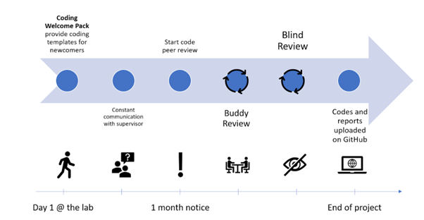

# Chapter 4: Open Source Software and Tools for Neuroscience
**Mar Barrantes-Cepas, Eva van Heese, Lucas Baudouin, Eva Koderman, Diana Bocancea**

## Reproducible Science
In this chapter, we’ll show you practical tools and software to help make your neuroscience research more reproducible. By using scripts instead of graphical interfaces, open source software and version control, you’ll not only make your own work easier to manage and build on in the future, but also ensure others can replicate your findings and easily collaborate with you. 

**Reproducibility** is at the core of good science—it helps move the field forward by making sure discoveries can be verified and expanded upon. Increasing reproducibility in neuroscience can be approached in two ways: from the top down, where institutions reshape incentives and frameworks (i.e. changes at the meso-level, read more [here](https://zenodo.org/records/10663903), and from the bottom up, where individual researchers adopt better practices. While both approaches are needed, this chapter focuses on the bottom-up—giving you the tools and guidelines to improve your own work. Adopting these practices early on will improve the quality of your research and contribute to a more reliable scientific community.

Although sharing data in clinical neuroscience can be challenging due to privacy concerns and logistical barriers, this shouldn’t be an excuse not to share your code and materials. Developing your work with this in mind, you can help promote transparency and reproducibility by ensuring that your code is shareable and accessible to others.

## Coding Fundamentals
You might already know much of what will be discussed in the following section. Should that be the case, you can browse through the headers and share your knowledge with your peers! Otherwise, here is a summary of some concepts you might need to better understand coding practices. 

### Basic concepts about programming
A **Graphical User Interface (GUI)** is a digital interface that allows users to interact with graphical elements such as icons, buttons, and menus (e.g., SPSS or FSL). GUIs are user-friendly because they provide intuitive visual cues for navigation and task execution. However, they are less effective for reproducibility, as it can be challenging to track or recall the exact steps and parameters used during analysis if you don’t note them somewhere. Moreover, scripts provide more flexibility and less manual work, which means more control over your data. 

To address these issues, it is advisable to **use scripts** for your methodology. Scripts provide a record of all actions taken and parameters used, making it easier to reproduce and share your work with others. Fortunately, many GUIs also offer the option to execute commands directly through a terminal. For instance, if properly installed, FSL commands can run from the terminal. If you want to learn more about this, you should consult the log files or documentation specific to the tool you are using.

In programming, just as in everyday life, a wide array of languages are available for writing your scripts—more than you might imagine! Check out the [List of programming languages - Wikipedia](https://en.wikipedia.org/wiki/List_of_programming_languages. The most commonly used languages in neuroscience are **Bash, C++, LaTeX, Python, MATLAB, and R**. The choice of language often depends on your personal preferences and the specific needs of your project. In this section, we'll outline the main differences between these languages, discuss Open Science-related considerations, and offer tips for making the most of each.

[Bash](https://www.gnu.org/software/bash/) is excellent for automating command-line tasks and system administration. It enables you to execute and automate terminal commands and call various tools through scripts. [C++](https://en.wikipedia.org/wiki/C%2B%2B) is used for computationally intensive projects, and most command-line tools are programmed with it due to its performance capabilities.

[Python](https://www.python.org/), [MATLAB](https://nl.mathworks.com/products/matlab.html), and [R](https://www.r-project.org/about.html#:~:text=R%20is%20a%20language%20and,by%20John%20Chambers%20and%20colleagues.) are high-level languages, meaning they are easy to use, understand, portable, and independent from specific hardware. Python is versatile and user-friendly, making it ideal for data analysis. R is designed specifically for statistical analysis and data visualisation, making it popular among statisticians and data scientists. MATLAB excels in numerical computation and visualisation but requires a paid licence.

[LaTeX](https://www.latex-project.org/) is also a programming language or tool that can simplify the preparation of your manuscript for publication (or documents in general). Some journals even offer their own LaTeX templates! It is specifically useful when your manuscript contains formulas, graphs that are still in the making or pieces of code since it allows you to easily add everything beautifully without spending too much time looking for the correct character. Different editors, such as Overleaf or VisualStudio Code, will enable you to use it. Some extra tools that will enhance your experience with LaTex are [Detexify](https://detexify.kirelabs.org/classify.html), which helps to find characters you might not know how are called or a [Tables converter] (https://www.tablesgenerator.com/) into LaTex format.

But there’s more to consider! Besides programming languages, you’ll also need to manage [libraries](https://careerfoundry.com/en/blog/web-development/programming-library-guide/) and tools. **Libraries** are collections of pre-written code that extend the functionality of a programming language and simplify complex tasks. Just as programming languages have different versions, libraries can also have multiple versions due to updates and bug fixes. When multiple people work on the same coding file (see below - Version control), it is important to use consistent versions of programming languages and libraries across the team. **Software tools** can act as GUIs to simplify data analysis. However, tools can be built using programming that are not open source (i.e., Matlab) and therefore the tools themselves are also not open source. 

Virtual environments and containers are tools used in software development to create **isolated and controlled environments** for running applications and managing dependencies.

A **virtual environment** in Python is an isolated environment that allows you to install and manage dependencies for a specific project without affecting the global Python installation or other projects. It helps ensure that each project can have its own dependencies and versions, avoiding conflicts between projects.

A **container** is an isolated unit, and is much more comprehensive tool that isolates not just the programming environment but the entire software environment, including the operating system, system libraries, runtime, and application code - making it more versatile for deploying and running consistent environments across different systems. Containers offer several advantages:
- *Portability and consistency*: Whether a container runs on a developer’s laptop or server, the bundled application will run consistently in various environments. 
- *Resource efficiency*: Containers are lightweight and use less memory and CPU compared to traditional virtual machines. 
- *Flexibility*: Individual components of an application can be updated, scaled, or deployed independently, leading to a more flexible development and deployment process. 
Containerised software is particularly useful in neuroscience research because it guarantees that processing pipelines run reliably and uniformly across different computing environments without researchers worrying about variations in software dependencies or system configurations, for example in collaborations between different institutes. This consistency is crucial for reproducibility in research.

Useful open-source tools within science also include LibreOffice and Inkscape. [LibreOffice](https://www.libreoffice.org/download/download-libreoffice/) is a free and open-source alternative to Microsoft Office applications like Word, PowerPoint, Excel, and Access. It offers similar functionalities for document creation, presentations, spreadsheets, and database management. For poster creation or data visualisation you can opt for [Inkscape](https://inkscape.org/). It is a free and open-source vector graphics editor that is widely used for creating and editing scalable vector graphics (SVG) files. 

### Tips and tricks on the coding fundamentals
To make your project  as open sciency as possible, we provide a few tips:
- GUIs might be useful for getting acquainted with the preprocessing or analysis steps. However, once you have that understanding, it might be better to switch to scripts.
- Opt for open-source programming languages and tools that don’t require a paid licence. While MATLAB might be available through your university, remember that someone still pays for it. 
- If you need a specific tool available in MATLAB, consider finding an open-source alternative. For example, NetworkX in Python offers many functionalities similar to those in the Brain Connectivity Toolbox, which is MATLAB-based.
- If you're developing a tool, open-source software can be beneficial: Even if you're used to MATLAB, exploring other languages like Python, R, or C++ could be a valuable opportunity to expand your skills!
- To ensure consistency and avoid issues, it's crucial to keep track of the versions of both the programming language and the libraries you use. When using Python, we recommend using [virtual environments](https://docs.python.org/3/library/venv.html) to manage multiple project environments and to keep your libraries and their versions organised. This approach will make it easier to handle libraries, maintain your projects, and share them with others. 

## Documentation and Version Control
This section offers guidance on optimising version control and documentation practices. It covers the best practices to streamline version control, how to integrate them within your team, and the ideal workflow to adopt for maximum efficiency.

When working on a script, it is important to document your code. **Documentation** is essential to make code understandable, discoverable, citable, and reusable. Check out Chapter 3 to obtain a better general understanding of documentation. More specific to code documentation, it is important to keep in mind the following:

- At the top of your script, you should describe the aim of the script
- Declare who wrote the code and when. Is it finished?
- Has anyone reviewed this code? When?
- Declare required libraries with their versions
- Describe the desired input and expected output of your code
- Beware of specific [programming languages conventions](https://www.freecodecamp.org/news/programming-naming-conventions-explained/)
- Document your code using [Docstrings](https://en.wikipedia.org/wiki/Docstring)
- Leave useful comments throughout the script to help others understand your code (i.e., what does a function do). Avoid unnecessary comments (i.e., if the function’s role is already evident from the function name).

To help get you started, you can check out these documentation templates, guidance, and examples. This tool is also useful for formatting your code - [Black Vercel](https://black.vercel.app/?version=stable&state=_Td6WFoAAATm1rRGAgAhARYAAAB0L-Wj4ASJAnldAD2IimZxl1N_WlkPinBFoXIfdFTaTVkGVeHShArYj9yPlDvwBA7LhGo8BvRQqDilPtgsfdKl-ha7EFp0Ma6lY_06IceKiVsJ3BpoICJM9wU1VJLD7l3qd5xTmo78LqThf9uibGWcWCD16LBOn0JK8rhhx_Gf2ClySDJtvm7zQJ1Z-Ipmv9D7I_zhjztfi2UTVsJp7917XToHBm2EoNZqyE8homtGskFIiif5EZthHQvvOj8S2gJx8_t_UpWp1ScpIsD_Xq83LX-B956I_EBIeNoGwZZPFC5zAIoMeiaC1jU-sdOHVucLJM_x-jkzMvK8Utdfvp9MMvKyTfb_BZoe0-FAc2ZVlXEpwYgJVAGdCXv3lQT4bpTXyBwDrDVrUeJDivSSwOvT8tlnuMrXoD1Sk2NZB5SHyNmZsfyAEqLALbUnhkX8hbt5U2yNQRDf1LQhuUIOii6k6H9wnDNRnBiQHUfzKfW1CLiThnuVFjlCxQhJ60u67n3EK38XxHkQdOocJXpBNO51E4-f9z2hj0EDTu_ScuqOiC9cI8qJ4grSZIOnnQLv9WPvmCzx5zib3JacesIxMVvZNQiljq_gL7udm1yeXQjENOrBWbfBEkv1P4izWeAysoJgZUhtZFwKFdoCGt2TXe3xQ-wVZFS5KoMPhGFDZGPKzpK15caQOnWobOHLKaL8eFA-qI44qZrMQ7sSLn04bYeenNR2Vxz7hvK0lJhkgKrpVfUnZrtF-e-ubeeUCThWus4jZbKlFBe2Kroz90Elij_UZBMFCcFo0CfIx5mGloKoK10y5eFtrgIZy3gUg3-VibDzoc8fXF63NR9AgKYXS1NQPXDXEwAAAABk7Jx28oPV2QABlQWKCQAAjbEry7HEZ_sCAAAAAARZWg==). 

### Git and GitHub
[Version control](https://book.the-turing-way.org/reproducible-research/vcs) is a method used to document and manage changes to a file or collection of files over time. It allows you and your collaborators to monitor the history of revisions, review modifications, and revert to previous versions when necessary. This is useful especially when working together on a  script. The most prevalent version control system that can help with that is Git.

**Git** is a [version control](https://en.wikipedia.org/wiki/Version_control) system that tracks file changes and coordinates work among multiple people on a project. **GitHub** and **GitLab** are web-based platforms that host **Git repositories**, along with additional features like issue tracking, code reviews, and continuous integration. The main difference between them is that GitHub is more focused on open-source collaboration and has a large user community, while GitLab offers more built-in tools and is known for its flexibility in deployment options, including self-hosting. Both of them allow the creation of private and public repositories. 

If you want to learn more about pros and cons and the current status of Git(-related) tools at Amsterdam UMC, please check [this link](https://zenodo.org/records/11065899). Check with your (co)supervisors about the best option to use or if they already have an account for the group. 

### How to create your own GitHub account
To create a GitHub account, link it with Git on your local machine, and verify the connection, follow these steps:

1. Create a GitHub Account:
- Go to github.com and click Sign up.
- Enter your email, password, and username. Then verify your email when prompted.
- After completing the sign-up steps, your account will be created.

2. Install Git (if not already installed):
- Download Git from git-scm.com and follow the installation instructions for your operating system.

3. Link Git with Your GitHub Account:
- Open a terminal or command prompt and configure your Git username and email (these should match your GitHub account):

`git config --global user.name "YourGitHubUsername"`
`git config --global user.email "your_email@example.com"`

The rest of these instructions are coming soon 
{: .label .label-yellow }

### How to use Git & GitHub
Once you have a good feeling of the Github lingo, the version control should be easy peasy. Here are some basics on the terminology and a tutorial to help get you started:
- A **repository** (or "repo") is a central location where a project's code, along with its version history, is stored and managed. It is essentially a folder in which your project's files and folders reside, along with all the necessary information to track changes, collaborate with others, and version control the project over time.
- A **branch** is an independent line of development within a repository. It allows you to work on different features, bug fixes, or experiments without affecting the main codebase. By default, every repository starts with a main (or master) branch, which is typically considered the primary or production-ready branch.
- **Pulling** a branch means fetching the latest changes from a remote repository (like GitHub) to your local environment. It updates your local copy with any new commits made by others.
- **Pushing** a branch means sending your local changes to the remote repository, making them available to others by updating the remote branch.
- 
Here is a [quick tutorial](https://docs.github.com/en/get-started/start-your-journey/hello-world) to help get you started with the basics and a visual representation of a github workflow.

[Image source](https://onesignal.com/blog/converting-github-repositories-to-main/)

The main or sometimes called the master branch is where your code lives as the main character. All the other branches are created for the development of a specific feature (or you can think of them as side quests). After the feature development is complete, and the code is fully tested and functional, you can merge it back into the main branch. Continue this process until all the feature development is complete.

### Git Ignore File
Before creating a new GIT repository and linking it to GitHub or GitLab, it's **EXTREMELY** important to make a .gitignore file. Without it, all files in your project, including potentially sensitive or personal data, will be tracked and uploaded by default. This could lead to unintentional data exposure that cannot be shared due to privacy regulations. 

To avoid this, make sure to create a .gitignore file listing all the file types and folders you want to exclude from version control. You can find more detailed guidance in the [Ignoring files - GitHub Docs](https://docs.github.com/en/get-started/getting-started-with-git/ignoring-files) and browse [Some common .gitignore configurations](https://github.com/github/gitignore) for examples. This practice ensures that only the necessary files are tracked, reducing the risk of accidentally sharing sensitive information.

### Linking Git and GitHub
The easiest way to use Git/GitHub is through a code editor such as Visual Studio Code ([Introduction to Git in Visual Studio Code](https://code.visualstudio.com/docs/sourcecontrol/intro-to-git)) or [GitHub Desktop](https://desktop.github.com/download/).

### Readme File
A [README](https://en.wikipedia.org/wiki/README) is a text file that introduces and explains a project because no one can read your mind (yet). It contains information that is commonly required to understand what the project is about. If you want to learn how to properly create a README file check: [Make a README](https://www.makeareadme.com/) (they also provide templates!) 

### Contributing File
Coming soon 
{: .label .label-yellow }

## Code Review and Code Test
A **general code workflow** should include several iterations of peer review and end with the scripts being uploaded on GitHub. Peer review ensures that the code is correct and functions well, while the publication of scripts online ensures these are shared with the wider scientific community and improves the reproducibility. In scripts, **correctness** refers to the code's ability to produce the intended results accurately according to specified requirements. In contrast, **reproducibility** ensures that these results can be consistently obtained by different users or in different environments when the same code is run with identical inputs. While correctness confirms that the code functions as intended, reproducibility guarantees that the outcomes can be reliably replicated, which is essential for validating research findings.

The general workflow of code review that ensures correctness and reproducibility is summarized in the figure below:

As you might notice, there should always be a code owner and a code reviewer who have separate tasks. 

**For the code owner:**
1. Start with your script. Try to write documentation in parallel with your computations, as this will save you time and help build good habits.
2. Talk to your supervisor about work ethic - are there standards on how the data should be stored? Data privacy guidelines? 
3. Create a GitHub account and version control your codes. At the end of your project, you should transfer your version controlled codes to the public repository.
4. Talk to your supervisor / the team about potential coding checkpoints for your project (e.g. “check codes together once we have Table or Figure 1”)
5. Find a suitable code reviewer at least one month before the end of your project. 
6. At this point, it is time to put your scripts onto an internal repository.
- You will need your own private GitHub account
- [Create a branch](https://www.howtogeek.com/714112/how-to-create-a-new-branch-in-github/) for your project
- Open a [Pull Request](https://docs.github.com/en/pull-requests/collaborating-with-pull-requests/proposing-changes-to-your-work-with-pull-requests/creating-a-pull-request)
7. When reviewers are assigned to your codes, the material should be ready for someone else to use them (e.g. formatted, documented, with a [requirements.txt](https://www.freecodecamp.org/news/python-requirementstxt-explained/), or similar for R/Matlab)
8. Implement the changes suggested by the reviewers (or discuss them in person, if necessary)
9. Celebrate the end of your project!

**For the reviewer:**
Please confirm that the code is understandable and well-documented. It is not your job to rewrite the code for the code owner or to test the code’s functionality. If you have to spend too much time on it, send it back to the owner with your remarks and ask them to improve it before your final revision.
1. Please check if the owner indicated the mandatory information (what the script is about, who wrote the code and when, declaring libraries with their versions)
2. Code peer review tutorials suggest not revising more than 400 lines in one go. Split the job to keep your eyes fresh!
3. If your revision is more on the computation/mathematical side, please ensure everything is correct, and results will not be compromised
4. Please indicate your suggestions in the GitHub Pull Request. This allows us to keep track of the comments and changes
5. For Python users, we strongly recommend the use of [virtual environments](https://docs.python.org/3/library/venv.html)

Additional good coding practice, in addition to the code review, is **code testing**. Code-based testing encompasses various methods to ensure software reliability and quality. Techniques like [unit and integration testing](https://codefresh.io/learn/unit-testing/unit-testing-vs-integration-testing-5-key-differences-and-why-you-need-both/) help developers validate their code. Unit testing checks individual components of code for correctness, while integration testing ensures that combined components work together as expected.

A key element of code testing is building a solid foundation of tests that cover different scenarios and edge cases. These tests serve as a safety net, offering ongoing feedback on code functionality. By thoroughly testing, developers can catch and fix issues early, reducing the time and effort needed for debugging and maintenance.

## Quality Assessment of Your Data
This section is coming soon 
{: .label .label-yellow }

### Packages for Data Descriptives and Visualization in Python and R

### Quality Control of Neuroimaging Data

### Quality Assessment of Other Types of Data

## Anonymising Data: Defacing and Editing Headers
This section is coming soon 
{: .label .label-yellow }

## Open Neuroimaging Analysis Tools
Within the neuroimaging field of neuroscience, many tools are open source and to be used by everyone. Some require a free licence that can be requested. 

We’ll review a selection of often applied software and tools:

| Software/tool        | Type of data         | Purpose | Openness?        | Recommended tutorials and resources   |
|:-------------|:------------------|:----------|:----------------|:----------------|
| [FSL](https://fsl.fmrib.ox.ac.uk/fsl/fslwiki/) | Several types of MR images | Process or view images from a variety of modalities | Fully Open | [FSL Course on Youtube](https://www.youtube.com/@FSLCourse)
|Table to be completed soon!| 

## Lab Analysis Tools
This section is coming soon 
{: .label .label-yellow }
